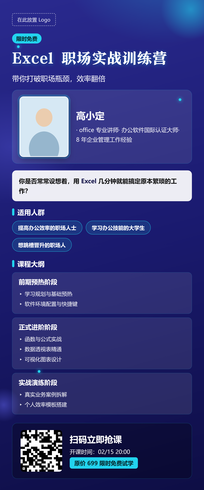
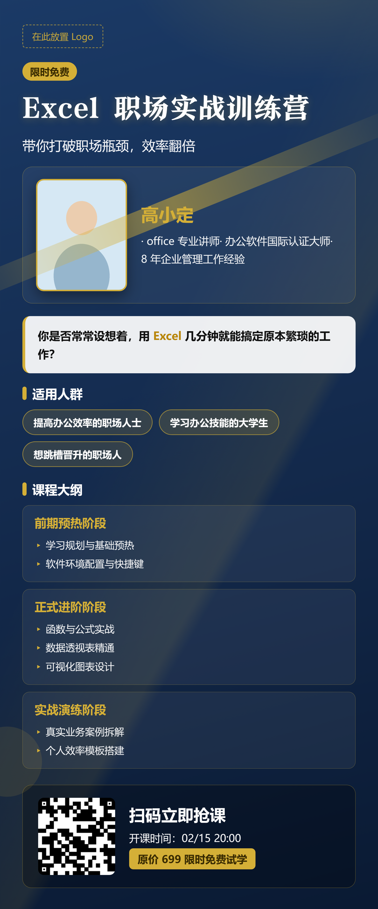
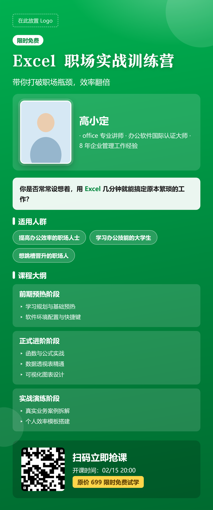
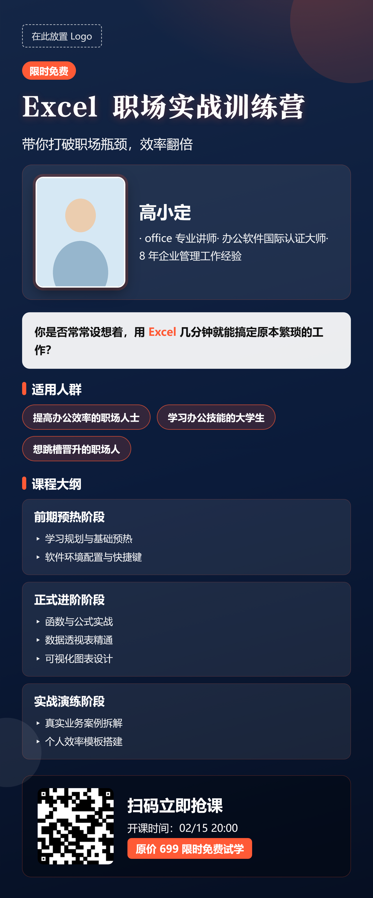

# 课程海报生成器（course-poster）

> **只要给「讲师信息 + 课程信息」，这个 skill 就能替你生成竖版课程海报。**
> 你不需要懂设计——AI 会根据课程内容**自动匹配并设计风格**。

---

## 这个 skill 能做什么

- **一句话出海报**：提供讲师信息（姓名 / 职务 / 头像）和课程信息（标题 / 大纲 / 时间地点价格），AI 自动生成 1080 宽竖版课程海报（PNG）。
- **AI 自动设计风格**：根据课程内容判断课程类型，自动选配背景情绪、装饰元素、强调色与字体，无需手动排版。
- **灵活内容块**：标题、讲师、大纲、数字、证言、报名区等 15 种内容块可自由增删、排序。
- **保留可改源文件**：每次生成同时保留 HTML，改文案后直接重渲，不用重新设计。
- **缺图不报错**：头像 / 二维码 / 宣传图缺失时自动画占位框，绝不中断。

适用场景：课程招生、讲师宣传、知识付费、讲座 / 公开课海报。

---

## AI 如何自动设计风格

你只需给课程信息，AI 会读取内容、判断课程类型（`topic`），再据此**自动**完成以下视觉决策——你不用做任何设计选择：

| 课程类型 topic | 背景情绪 | 装饰元素 | 强调色 |
|---|---|---|---|
| `ai` 人工智能 | 深空紫蓝 | 星轨 / 神经节点 | 荧光青 `#22D3EE` |
| `finance` 金融 | 深蓝 | 金线角标 | 金 `#D4AF37` |
| `ecommerce` 电商 | 午夜蓝 | 点阵 | 橙红 `#FF5A36` |
| `management` 管理 | 草绿 | 波纹 | 草绿 `#8FE3A8` |
| `education` 教育 | 清新蓝绿 | 波纹 | 蓝绿 `#7CE0C9` |
| `business` 商务 | 宝蓝 | 点阵 | 橙 `#FF8A3D` |

> 想手动指定风格也可以：告诉 AI「用金融风」「套 purple-tech 模板」即可覆盖自动判断。

---

## 海报风格展示

同一套内容，AI 会根据课程类型生成不同视觉。下面 5 张为各风格样张：

| 风格 | 样张 |
|---|---|
| **AI · 深空紫蓝（星轨）** |  |
| **商务 · 宝蓝（点阵）** |  |
| **金融 · 深蓝金线** |  |
| **管理 · 草绿波纹** |  |
| **电商 · 午夜蓝点阵** |  |

> 实际出图由 AI 根据你所给课程内容自动选定风格，无需你从上面挑。

---

## 安装到智能体

**不需要命令行、不需要懂 Git。** 给你正在用的任意智能体发一句话即可：

```
请给我安装这个技能：https://github.com/luofei614/course-poster
```

支持所有支持 SKILL 的智能体，例如：**WorkBuddy、Codex、Claude Code、Hermes、Kimi、扣子（Coze）** 等。

安装完成后，在对话里说「帮我生成一张课程海报」就能直接触发。

---

## 在智能体里对话使用

采用**两步工作流**，确保海报符合你的预期：

**第一步（只出方案，不出图）**：你给课程信息后，AI 先给出**文字版布局方案**（用哪些模块、顺序、配色与装饰思路），等你确认。

**第二步（确认后出图）**：你回复「可以 / 按这个来」，AI 生成 PNG 成品，并保留 HTML 源文件。

### 你只需要提供两类信息

1. **讲师信息**：姓名、职务、头像图片路径（可选，缺失自动占位）
2. **课程信息**：课程标题、大纲 / 亮点、时间 / 地点 / 价格、二维码（可选）

### 示例对话

```
你：帮我做一张 AI 公开课海报。讲师罗飞，职务是 AI 顾问，
    课程讲企业如何落地 AI，时间是 9 月 10 日线下。

AI：好的，我先给文字方案——
    · 风格：AI 深空紫蓝 + 星轨装饰（按课程内容自动匹配）
    · 模块顺序：品牌条 → 主标题 → 讲师卡 → 痛点 → 大纲 → 报名
    · 配色：深紫底 + 荧光青强调，标题用书法宋体
    确认后我出图。

你：可以，按这个来。

AI：（生成 course-poster.png + course-poster.html）
```

### 产出

- `*.png` —— 社群成品图
- `*.html` —— 保留的网页源，改文案后让 AI 直接重渲即可

---

## 进阶玩法

- **指定风格**：「用金融风」「套 gold-wealth 模板」可覆盖自动判断。
- **自定义内容**：告诉 AI 增删模块（如加「学员证言」「课程对比」）。
- **改文案重渲**：直接说「把价格改成 199 元，重新出图」，AI 改局部重渲，不动布局。

> 字体、字号、渲染细节等高级自定，参见仓库内 `SKILL.md`。

---

## 常见问题

**Q：头像 / 二维码没给会怎样？**
A：自动画虚线占位框，海报照常生成，后续补图重渲即可。

**Q：首次渲染字体没显示正常？**
A：内置字体由技能自动管理，智能体在需要时自行拉取，无需手动操作。

**Q：想换配色或字体？**
A：告诉 AI 你的偏好即可；深层自定义见 `SKILL.md`。

---

## 说明

内置字体（微软雅黑 / 方正颜宋 / 思源黑体）版权归各自厂商所有，仅随技能离线使用，请遵守对应字体授权。技能代码可自由用于课程海报生成。
